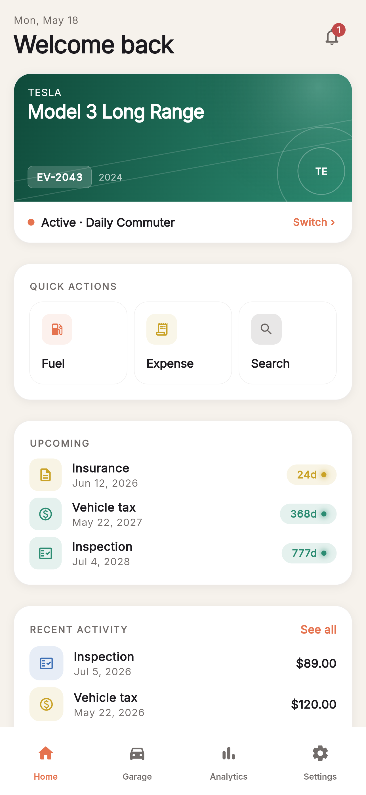
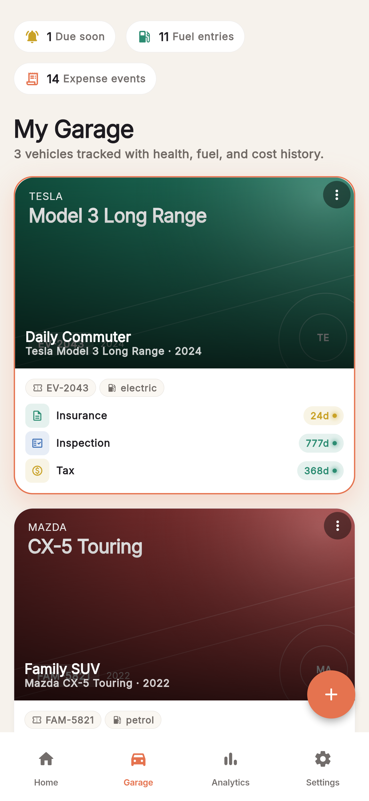
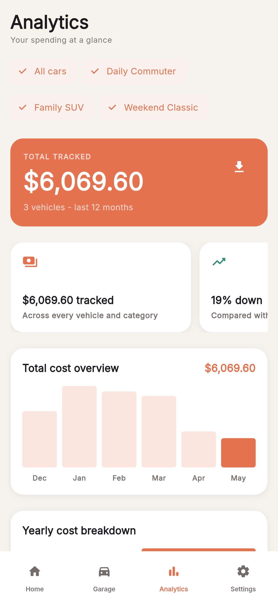
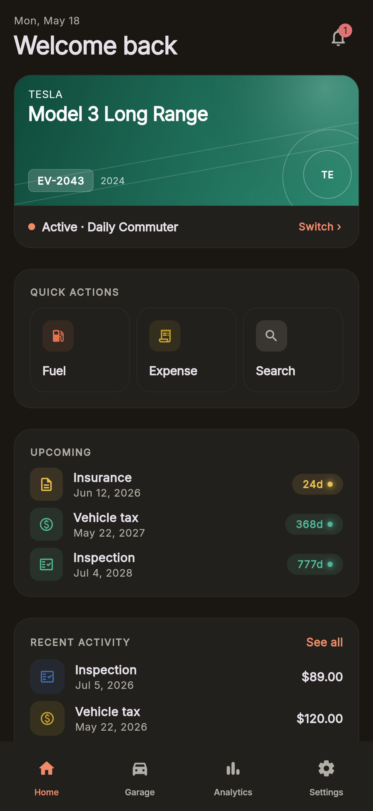
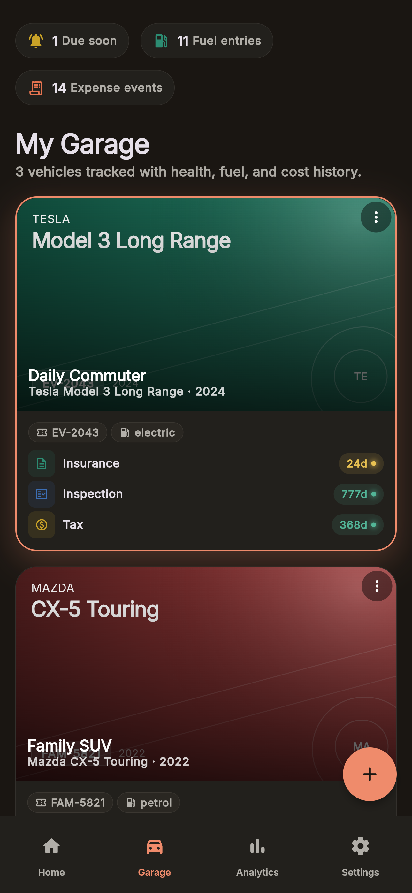
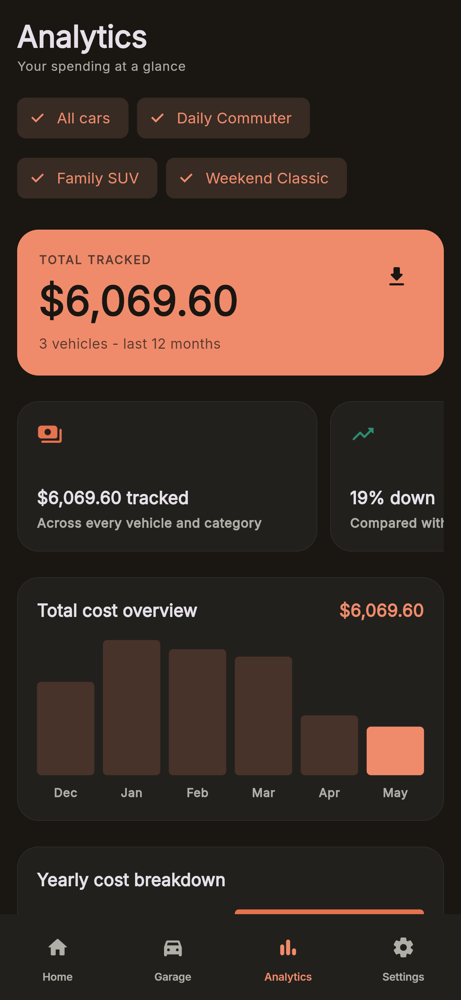

<div align="center">
  <div style="display:flex;padding-block:40px;margin-bottom:20px;justify-content:center">
    <picture>
      
    </picture>
  </div>

# Cars Manager


</div>

Cars Manager is a local-first vehicle companion for tracking fuel, maintenance, insurance, taxes, fines, repairs, deadlines, and ownership costs from one calm dashboard.

---

## Table of Contents

- [Features](#features)
- [Screenshots](#screenshots)
- [Architecture](#architecture)
- [Getting Started](#getting-started)
  - [Prerequisites](#prerequisites)
  - [Run Locally](#run-locally)
  - [Useful Commands](#useful-commands)
- [Builds and Release](#builds-and-release)
  - [Android APK](#android-apk)
  - [Web](#web)
  - [GitHub Release](#github-release)
- [Configuration](#configuration)
- [Project Structure](#project-structure)
- [License](#license)

---

## Features

- **Vehicle dashboard** — active car hero, monthly summary, recent activity, quick actions, and upcoming deadlines.
- **Garage management** — add, edit, delete, and switch vehicles with image-led cards and status indicators.
- **Vehicle detail pages** — overview, fuel, expenses, and timeline tabs for each car.
- **Fuel tracking** — fuel entries, total spend, liters/kWh, average prices, and year-based charts.
- **Expense tracking** — insurance, inspection, tax, repair, and fine records with category-specific views.
- **Reminders** — local notifications for insurance, inspection, and tax due dates.
- **Analytics** — total cost overview, category breakdown, cost per car, monthly trend table, and CSV export.
- **Search** — global search across vehicles and tracked records.
- **Settings** — theme, language, units, currency, notification preferences, export, reset, and app info.
- **Internationalisation** — English and Italian UI through Flutter gen-l10n.
- **Responsive layout** — bottom navigation on mobile, navigation rail on tablet, sidebar on desktop.
- **Cross-platform** — Android, iOS, web, Windows, macOS, and Linux project targets.

---

## Screenshots

<table>
  <tr>
    <th>Dashboard</th>
    <th>Garage</th>
    <th>Analytics</th>
  </tr>
  <tr>
    <td></td>
    <td></td>
    <td></td>
  </tr>
  <tr>
    <td></td>
    <td></td>
    <td></td>
  </tr>
</table>

---

## Architecture

```text
┌─────────────────────┐
│  Flutter App        │
│  Material + Router  │
└────────┬────────────┘
         │ GoRouter routes
┌────────▼─────────┐       ┌────────────────────┐
│  Feature Screens │ ◄───► │ Riverpod Providers │
│  Home/Garage/etc.│       │ App state + logic  │
└────────┬─────────┘       └─────────┬──────────┘
         │                           │
┌────────▼─────────┐       ┌─────────▼──────────┐
│ Shared UI System │       │ Local Persistence  │
│ Widgets + tokens │       │ JSON / localStorage│
└──────────────────┘       └────────────────────┘
```

Cars Manager keeps the app local-first: vehicle data is stored on-device, while the UI is built around Riverpod state, GoRouter navigation, Freezed models, and shared design tokens.

---

## Getting Started

### Prerequisites

| Tool    | Version                            |
| ------- | ---------------------------------- |
| Flutter | stable channel                     |
| Dart    | bundled with Flutter               |
| Node.js | >= 20, only for repository tooling |
| npm     | >= 10, only for repository tooling |

---

### Run Locally

```bash
git clone https://github.com/thisispivi/CarsManager.git
cd CarsManager
npm install

cd cars_manager
flutter pub get
flutter run
```

For web:

```bash
cd cars_manager
flutter run -d chrome
```

---

### Useful Commands

```bash
# From repository root
npm run verify
npm run analyze
npm run test
npm run build:android
npm run build:web
```

```bash
# From cars_manager/
flutter pub get
flutter gen-l10n
dart run build_runner build --delete-conflicting-outputs
flutter analyze
flutter test
```

---

## Builds and Release

### Android APK

Build release APKs split by device architecture:

```bash
cd cars_manager
flutter build apk --release --split-per-abi
```

Output files:

| ABI        | APK                                                         |
| ---------- | ----------------------------------------------------------- |
| ARM 64-bit | `build/app/outputs/flutter-apk/app-arm64-v8a-release.apk`   |
| ARM 32-bit | `build/app/outputs/flutter-apk/app-armeabi-v7a-release.apk` |
| x86 64-bit | `build/app/outputs/flutter-apk/app-x86_64-release.apk`      |

Build one universal APK instead:

```bash
cd cars_manager
flutter build apk --release
```

Universal APK output:

```text
build/app/outputs/flutter-apk/app-release.apk
```

---

### Web

```bash
cd cars_manager
flutter build web --release
```

Output:

```text
build/web/
```

---

### GitHub Release

The repository has a release workflow that runs tests, builds APKs, builds web, and publishes APK files to a GitHub Release when a version tag is pushed.

```bash
# 1. Update version in cars_manager/pubspec.yaml
# Example:
# version: 2.0.1+2

git add cars_manager/pubspec.yaml CHANGELOG.md
git commit -m "chore(release): v2.0.1"
git tag v2.0.1
git push origin main --tags
```

Beta tags are supported:

```bash
git tag v2.0.1-beta.1
git push origin main --tags
```

After the workflow finishes, download APKs from the GitHub Release page or from the workflow artifacts.

---

## Configuration

| File                                       | Purpose                                                 |
| ------------------------------------------ | ------------------------------------------------------- |
| `cars_manager/pubspec.yaml`                | Flutter dependencies, assets, version, package metadata |
| `cars_manager/flutter_launcher_icons.yaml` | Launcher icon generation settings                       |
| `cars_manager/flutter_native_splash.yaml`  | Native splash screen generation settings                |
| `cars_manager/l10n.yaml`                   | Localization generation settings                        |
| `cars_manager/assets/data/cars.json`       | Seed/sample vehicle data                                |
| `cars_manager/lib/l10n/app_en.arb`         | English strings                                         |
| `cars_manager/lib/l10n/app_it.arb`         | Italian strings                                         |

Regenerate launcher icons:

```bash
cd cars_manager
dart run flutter_launcher_icons
```

Regenerate splash screens:

```bash
cd cars_manager
dart run flutter_native_splash:create --path=flutter_native_splash.yaml
```

---

## Project Structure

```text
CarsManager/
├── .github/
│   └── workflows/                 # CI, release, and web deploy workflows
├── cars_manager/
│   ├── android/                   # Android runner project
│   ├── ios/                       # iOS runner project
│   ├── linux/                     # Linux runner project
│   ├── macos/                     # macOS runner project
│   ├── web/                       # Web runner assets and manifest
│   ├── windows/                   # Windows runner project
│   ├── assets/
│   │   ├── data/                  # Seed data
│   │   └── icons/                 # App logo and SVG category icons
│   ├── lib/
│   │   ├── app/                   # App root, router, app-level state
│   │   ├── core/                  # Theme, services, storage, utilities
│   │   ├── design_system/         # Shared atoms, molecules, charts, organisms
│   │   ├── features/              # Home, garage, analytics, settings, onboarding
│   │   ├── l10n/                  # ARB files and generated localizations
│   │   ├── models/                # Domain models
│   │   ├── presentation/          # Shared presentation widgets and migrated pages
│   │   └── main.dart              # Application bootstrap
│   ├── test/                      # Unit and widget tests
│   └── integration_test/          # Integration smoke tests
├── scripts/                       # Repository helper scripts
├── package.json                   # Root automation scripts
└── README.md
```

---

## License

[MIT](LICENSE) - Copyright (c) 2025 Andrea Piras
